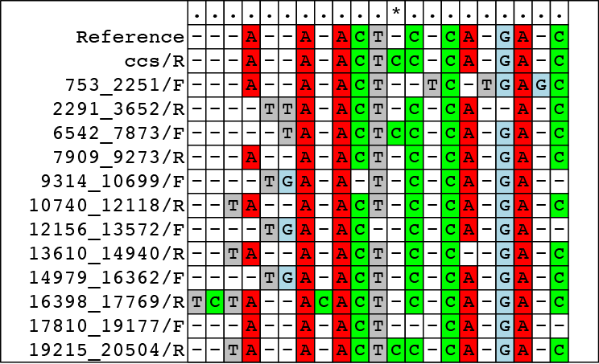

ccsviewr is a package for examining the underlying evidence for a base call in a
consensus read that was derived by combining the information of multiple
subreads.  It produces multiple sequence alignments of variant calls that can be
printed to the screen or to a PDF.  To use it, one needs:

- A BAM file with the original subreads
- A BAM file with the CCS reads aligned to a reference (can be generated with pbalign).
- A fasta file that the CCS reads were aligned to

## Installation

```
install.packages("devtools")
library(devtools)
# Install pbbamr dependency
install_github("PacificBiosciences/pbbamr")
# Install ccsviewr
install_github("PacificBiosciences/ccsviewr")

```
Note that on some PacBio machines, a configuration conflict may lead to the 
message `Problem with the SSL CA cert (path? access rights?)`.  If this appears,
simply run the following command before those given above:

    httr::set_config( httr::config( ssl_verifypeer = 0L ) )

## Generating a multiple sequence alignment plot


### Step 1 - Collect pairwise alignments

To begin, we will load the data and perform a series of pairwise alignments 
between the reference genome section aligned and all the subreads. The code
below loads some example data distributed with the package containing a small
BAM file, and we will use it to load the consensus read and subreads for all the
data from ZMW #9^[Typically one might want to investigate a CCS read that was identified by [ccscheck](https://github.com/PacificBiosciences/ccscheck)].

```{r, echo=TRUE, results='asis'}
library(ccsviewr)
# For this example, we will load some sample data
# distributed with the package.
ccs_name = system.file("extdata", "sample.aligned.ccs.bam", package="ccsviewr")
subreads_name = system.file("extdata", "sample.subreads.bam", package="ccsviewr")
fasta_name = system.file("extdata", "sample.fna", package="ccsviewr")

# Now let's collect data for one ZMW
hole = 9 # This is the ZMW we want data for
alns = getAlignments(hole, ccs_name, subreads_name, fasta_name)
```

`getAlignments` is a function that returns a list of pairwise alignments between
the CCS read and subreads against the section of the reference genome the CCS
read aligned to (as determined from the BAM file).  For more details see
`?getAlignments`.

### Step 2 - Filter out noisy subreads

The alignments to the reference returned in Step 1 were global alignments that
will all be combined to generate one plot. We intend to plot all of this data
together, however subreads that are particularly noisy (partial pass, missed
adapter, etc.) will cause a lot of insertions and "noise" in this plot, so we
want to remove these subreads ahead of time.

Therefore, we will want to examine the alignment quality and remove any 
particularly noisy samples before plotting to clarify the image.  The easiest 
way to do this is to just examine the scores of the alignments produced (higher
scores indicate a better alignment). In the code below we create a table of
these scores.

```{r, echo=TRUE}
trimNamePrefix = function(x) sub("m160311_183010_42237_c100992522550000001823224507191630_s1_p0/9/", "", x)
scores = data.frame(name = sapply(alns, function(x) trimNamePrefix(x$id)),
                    score = sapply(alns, function(x) x$score))

knitr::kable(scores)
```

As you can see from the table, the high quality CCS read (first in the list) has
a good score, while most of the subreads are in the -400 range.  However, we can
identify 3 subreads that are particularly bad.  The first and last subreads were
only partial passes so have low scores.  Additionally, the subread 3695_6500/F
appears to have a very low score.  We can also see that it disrupts the
alternating pattern of Forward/Reverse subreads (The "/F" or "/R" indicates if
the subread aligned in the forward or reverse direction), indicating that it is
almost certainly a missed adapter (which can be confirmed by examining
`alns[[5]]`).

After examining this table, we will remove these bad subreads by simply
filtering on the score.

```{r, echo=TRUE}
bad_alns = which(scores$score < -500)
clean_alns = alns[-bad_alns]
```

Note that if desired, you can keep the noisy reads in, however to make the 
plotting manageable it is highly recommended to identify a subset of the
alignment to plot as described in Step 4 to avoid long computation times when
the graphic is produced.


### Step 3 - Convert pairwise alignments to data frame

Now we will convert the cleaned alignments into one large data frame.  The key 
part of this process is "gapifying" all the pairwise alignments so that the 
available reference bases line up but that all insertions/deletions are
shown^[Note that very few programs show all insertions (for example they are not
available in IGV).  This is because showing all insertions can crowd the view,
which is why we need to remove very noisy reads in the previous step.)]

```{r, echo=TRUE}
  df = AlnsToDataFrame(clean_alns)

```

### Step 4 - Create a PDF with your alignment

Now that we have an alignment frame, we can make a PDF of the multiple sequence
alignment.

```{r, echo=TRUE, eval=FALSE}
plotMSA(df, "FullAlignment.pdf")
```

The PDF is produced by grid graphics under the hood, which can take a heck of 
long time for large alignments.  As such, it is often much faster to output a 
subsection of the entire alignment, which also leads to smaller PDF files that
are easier to load and display in PowerPoint.

To select a subsection of the alignment you have three options.

- You can examine the whole alignment file and use the position guides at
the top to select a window to plot (every 10 positions in the alignment are
identified by a "|"), and then use those guides to define a window

- You can write the data frame to a CSV file (e.g. `write.csv(df, file="myMSA.csv")`)
and then load it into a simple text editor to identify the window to plot.

- You can calculate the window of interest **a priori**.  The refernce sequence
begins at the location given by the `tstart` field in the pbi index file for the
aligned CCS BAM file.  This bit of information combined with simple text
manipulations can tell you where any reference coordinate is located in the
alignment space.


With a subwindow defined, you can now easily make a PDF plot for a collaborator 
or powerpoint.  As an example, we'll look at one window where a "C" in the
reference has been emitted as a "CC" in consensus ^[This is almost certainly
because this ZMW had a C channel SNR of 1.85, well beneath the default threshold
and outside of the range for which the consensus model is accurate.]. 
Additionally, we will make the plot a bit prettier by changing the read names to
remove the long movie/hold prefix.

```{r, echo=TRUE, eval=FALSE}
# Clean up the read names
rnames = as.character(df$id)
df$id = factor(sapply(rnames, trimNamePrefix))
# Now make a cleaner looking PDF
plotMSA(df, "AlignmentWindow.pdf", start = 40, end=60, showPositions = FALSE)
```

This will produce an alignment file as shown below (though this is a Rasterized
version of the PDF created for the web, the PDF is much higher resolution as it
is a vector format).



